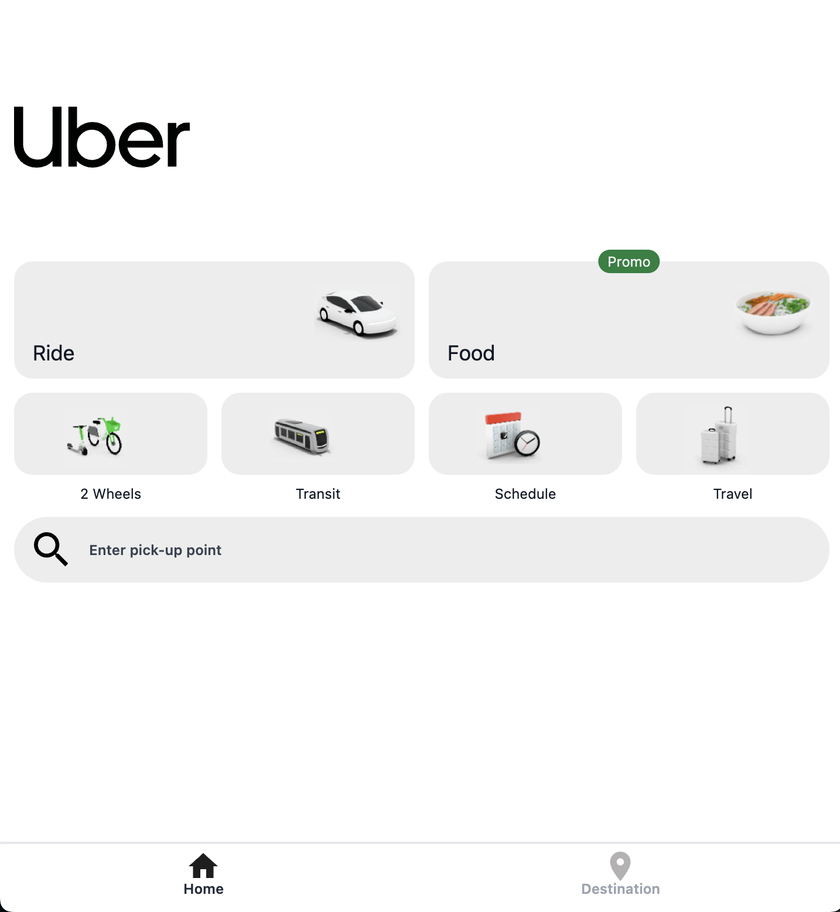
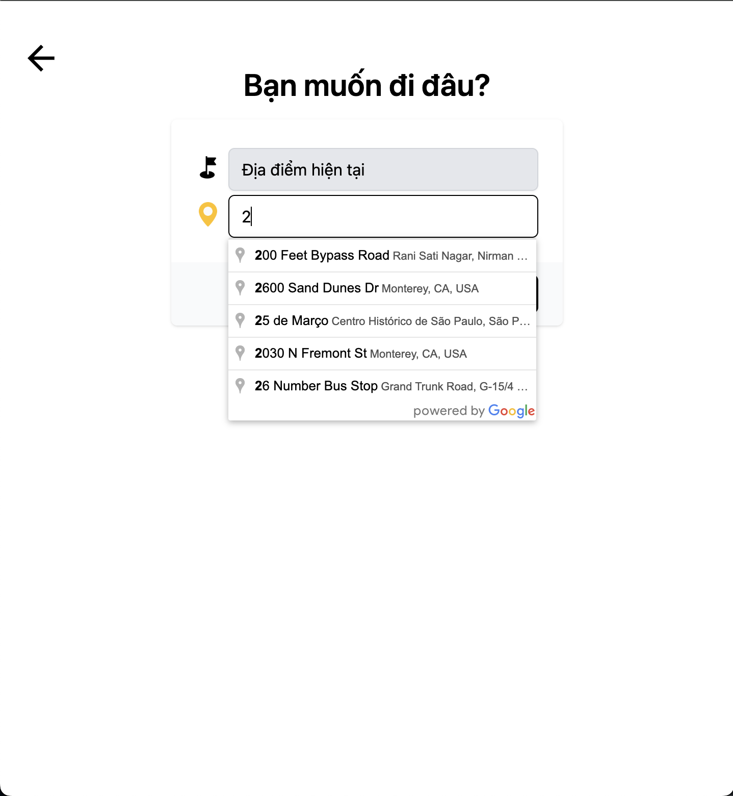
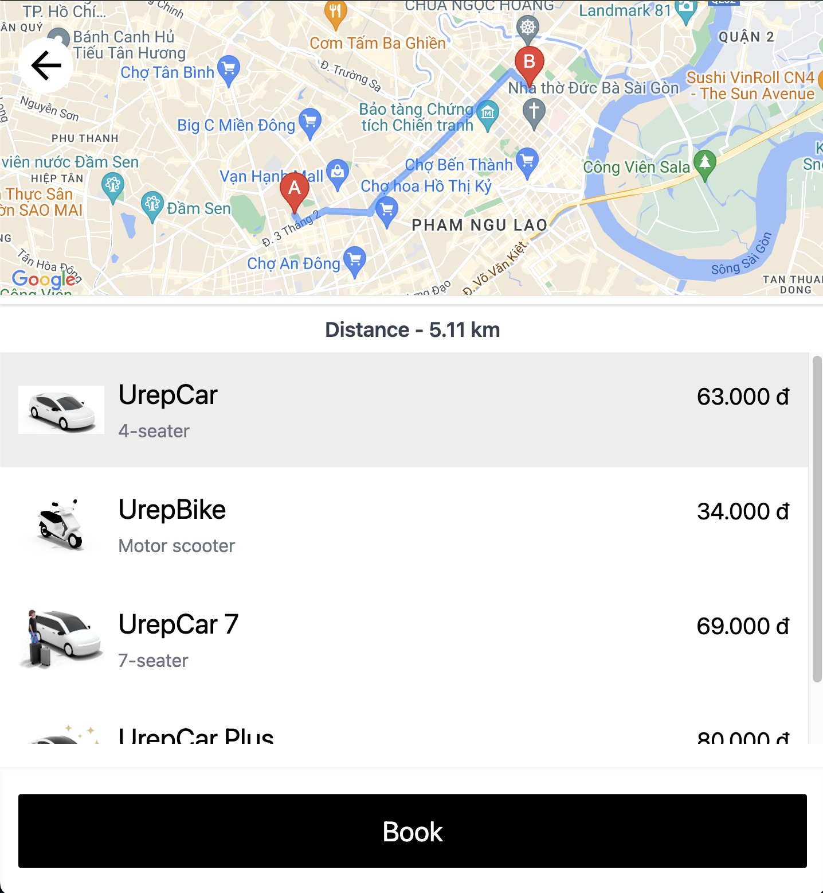
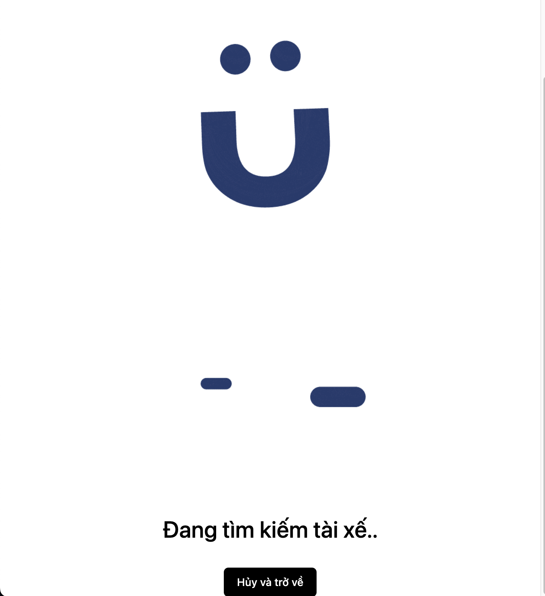
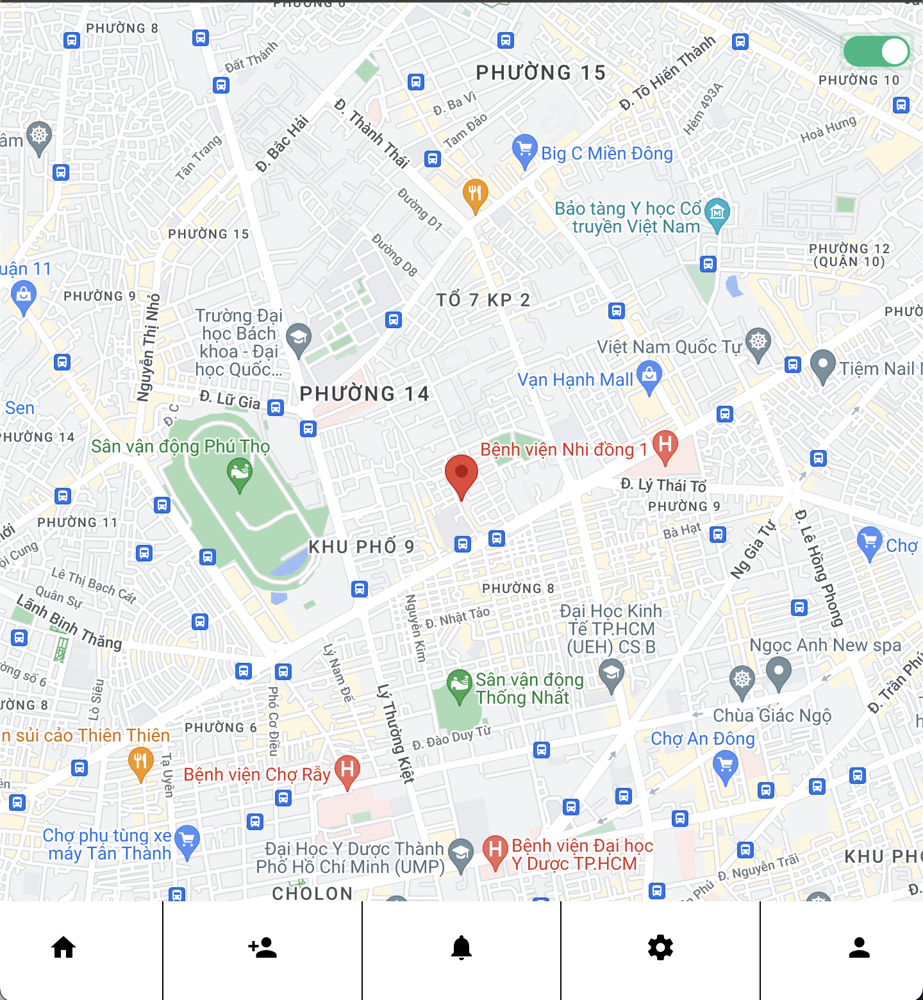
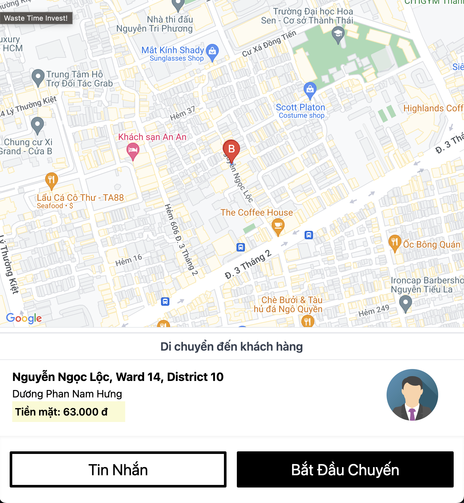
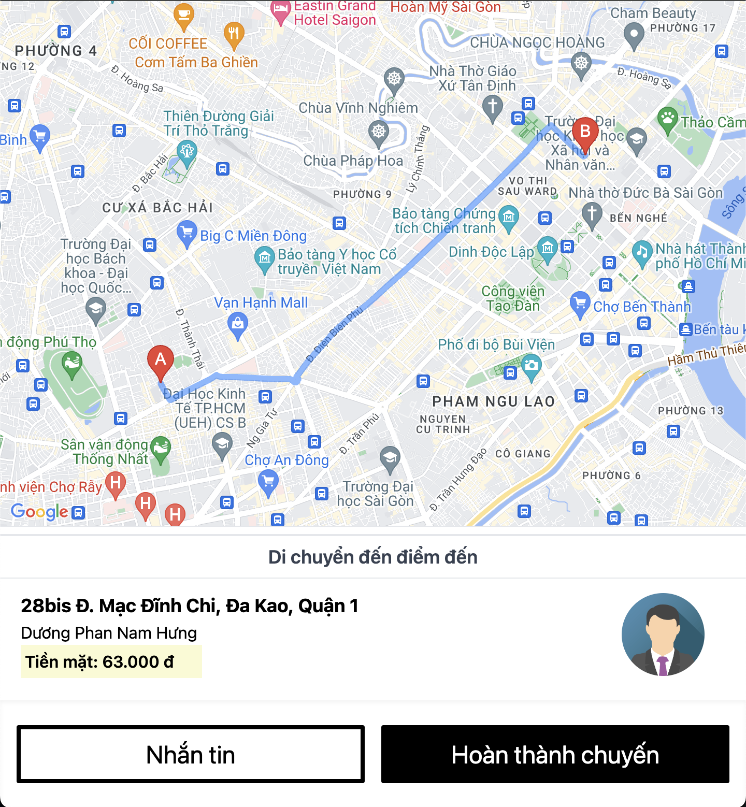
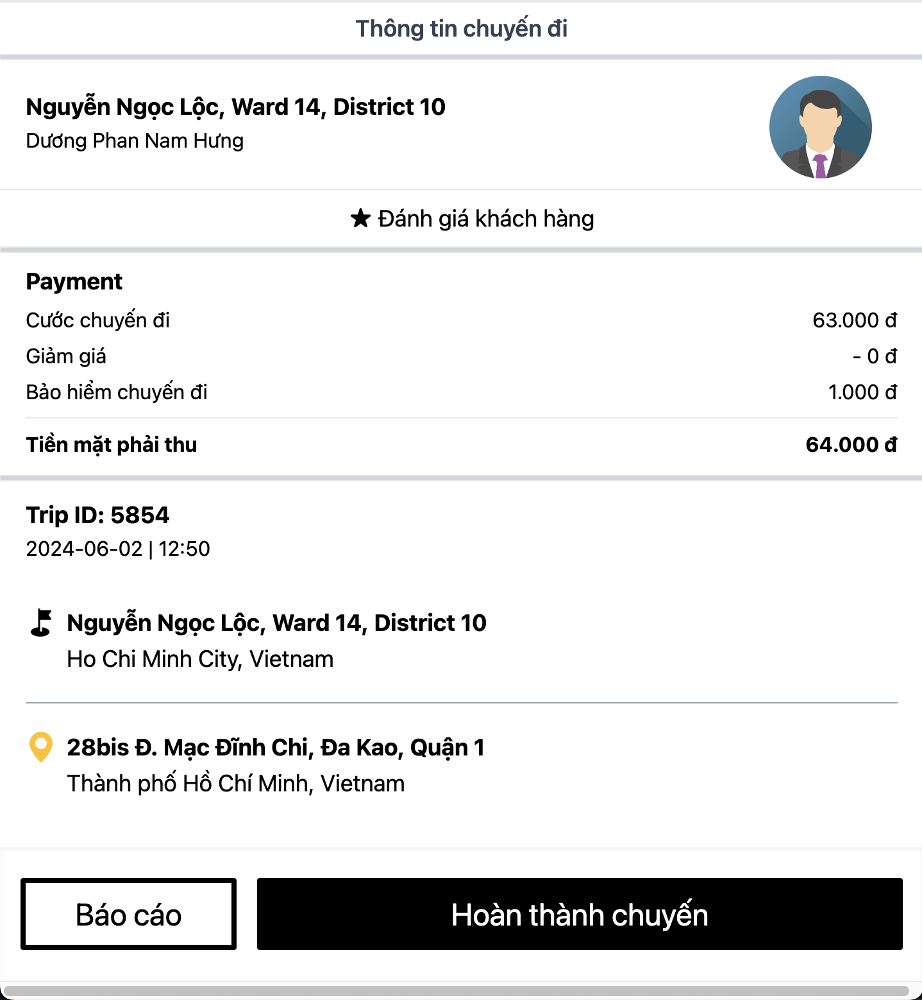
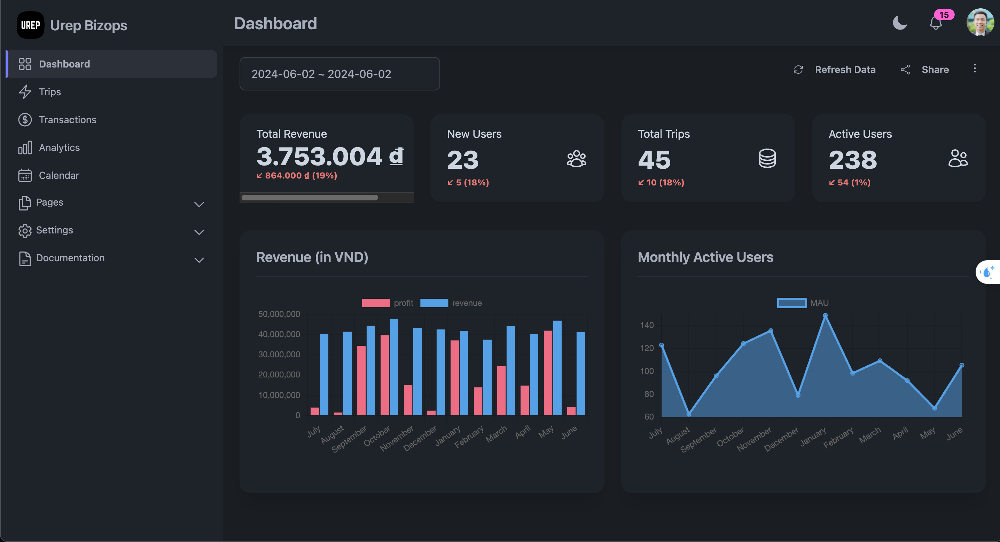
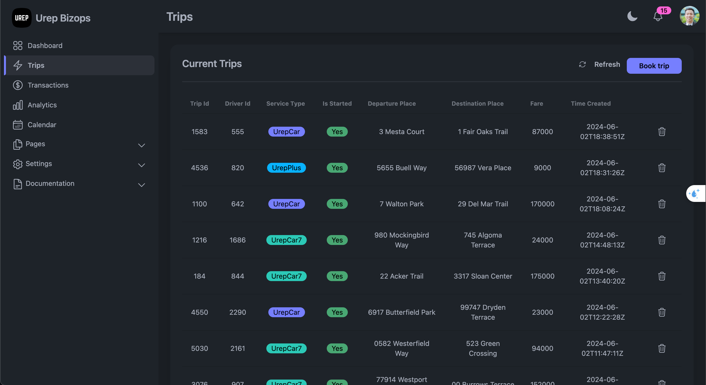

# uber-replica
A uber replica (Customer and Driver app) with Golang (Gin) and VueJS and Bizops app with React & TailwindCSS

## How to run:
for server osrm and db: `docker-compose up --build`
(Container osrm need to generate data at `backend/data`, try on this [document](https://gist.github.com/AlexandraKapp/e0eee2beacc93e765113aff43ec77789))

for backend: `./backend/go run main.go` (on packaging to container)

for customer and driver frontend: `./frontend/npm run serve` (on packaging to container)

for bizops app: `./bizops/npm start` (on packaging to container)

## Customer app
#### Customer main

#### Customer input address

#### Customer map and pricing

#### Customer waiting for driver accept

## Driver app
#### Driver main (On or Off accepting)

#### Driver come to customer

#### Driver drive to destination

#### Summarise trip

## Bizops
#### Dashboard

#### List trips
